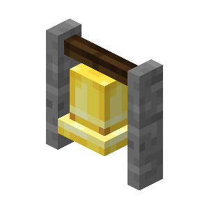

[![Contributors][contributors-shield]][contributors-url]
[![Forks][forks-shield]][forks-url]
[![Stargazers][stars-shield]][stars-url]
[![Issues][issues-shield]][issues-url]
[![MIT License][license-shield]][license-url]


<!-- PROJECT LOGO -->
<br />
<p align="center">
  <a href="https://github.com/NoeJuza/open-twitch-pinger">
    
  </a>

  <h3 align="center">Open Twitch Pinger</h3>

  <p align="center">
    "In a dark age of Discord, a New Era of Freedom Shall Rise!"
    <br />
    <a href="./MANIFESTO.md">Read the manifesto</a>
    ·
    <a href="https://github.com/NoeJuza/open-twitch-pinger/issues">Report Bug</a>
    ·
    <a href="https://github.com/NoeJuza/open-twitch-pinger/issues">Request Feature</a>
  </p>
</p>


<!-- TABLE OF CONTENTS -->
## Table of Contents

* [About the project](#about-the-project)
  * [Built With](#built-with)
* [Getting Started](#getting-started)
  * [Prerequisites](#prerequisites)
* [Usage](#usage)
  * [Docker](#installation-and-running-the-docker-version)
  * [Plain NodeJs](#installation-and-running-the-good-ol-nodejs-version)
* [Roadmap](#roadmap)
* [Contributing](#contributing)
* [License](#license)
* [Contact](#contact)


<!-- ABOUT THE PROJECT -->
## About the project

This project is used to get notified when a list of streamers go live in a specific discord channel


### Built With

* [Node.js](https://nodejs.org/en/)
* [Twitch API JS](https://d-fischer.github.io/twitch/)
* [DJS](https://discord.js.org/#/)
* [leveljs](https://leveljs.org/)


<!-- GETTING STARTED -->
## Getting Started

To get a local copy up and running follow these simple steps.

### Prerequisites

You will need to install:
* [Git](https://git-scm.com/)

* [Node.js](https://nodejs.org/en/)
* [npm](https://www.npmjs.com/)
OR
* [Docker](https://www.docker.com/)


* npm
```sh
npm install npm@latest -g
```
<!-- USAGE EXAMPLES -->
## Usage
### Installation and running The docker version:
1. Pull the image from the repo and run it:
```sh
docker pull noejuza/open-twitch-pinger
docker run --restart always -dit --name discordbot -e DISCTOKEN=your_discord_bot_token -e DISCID=your_discord_app_id -e TWITCHID=your_twitch_app_id -e TWITCHSECRET=your_twitch_secret --mount source=opentwitchervol,target=/usr/src/app noejuza/open-twitch-pinger
```

### Installation and Running The good-ol nodeJS version

1. Clone the repo
```sh
git clone https://github.com/NoeJuza/open-twitch-pinger.git
cd open-twitch-pinger
```
2. Add a ".env" file to the root of the project
```sh
touch .env
```
In this .env file add: 
```.env
DISCTOKEN=your_discord_bot_token
DISCID=your_discord_app_id
TWITCHID=your_twitch_app_id
TWITCHSECRET=your_twitch_secret
```
3. Install NPM packages and run the bot
```sh
npm install && npm run
```


<!-- ROADMAP -->
## Roadmap

See the [open issues](https://github.com/NoeJuza/open-twitch-pinger/issues) for a list of proposed features (and known issues).


<!-- CONTRIBUTING -->
## Contributing

Contributions are what make the open source community such an amazing place to be learn, inspire, and create. Any contributions you make are **greatly appreciated**.

1. Fork the Project
2. Create your Feature Branch (`git checkout -b feature/AmazingFeature`)
3. Commit your Changes (`git commit -m 'Add some AmazingFeature'`)
4. Push to the Branch (`git push origin feature/AmazingFeature`)
5. Open a Pull Request


<!-- LICENSE -->
## License

Distributed under the MIT License. See `LICENSE` for more information.


<!-- CONTACT -->
## Contact

NoeJuza - noe.juzan.pro@gmail.com

Project Link: [https://github.com/NoeJuza/open-twitch-pinger](https://github.com/NoeJuza/open-twitch-pinger)


<!-- MARKDOWN LINKS & IMAGES -->
<!-- https://www.markdownguide.org/basic-syntax/#reference-style-links -->
[contributors-shield]: https://img.shields.io/github/contributors/NoeJuza/open-twitch-pinger.svg?style=flat-square
[contributors-url]: https://github.com/NoeJuza/open-twitch-pinger/graphs/contributors
[forks-shield]: https://img.shields.io/github/forks/NoeJuza/open-twitch-pinger.svg?style=flat-square
[forks-url]: https://github.com/NoeJuza/open-twitch-pinger/network/members
[stars-shield]: https://img.shields.io/github/stars/NoeJuza/open-twitch-pinger.svg?style=flat-square
[stars-url]: https://github.com/NoeJuza/open-twitch-pinger/stargazers
[issues-shield]: https://img.shields.io/github/issues/NoeJuza/open-twitch-pinger.svg?style=flat-square
[issues-url]: https://github.com/NoeJuza/open-twitch-pinger/issues
[license-shield]: https://img.shields.io/github/license/NoeJuza/open-twitch-pinger.svg?style=flat-square
[license-url]: https://github.com/NoeJuza/open-twitch-pinger/blob/master/LICENSE
